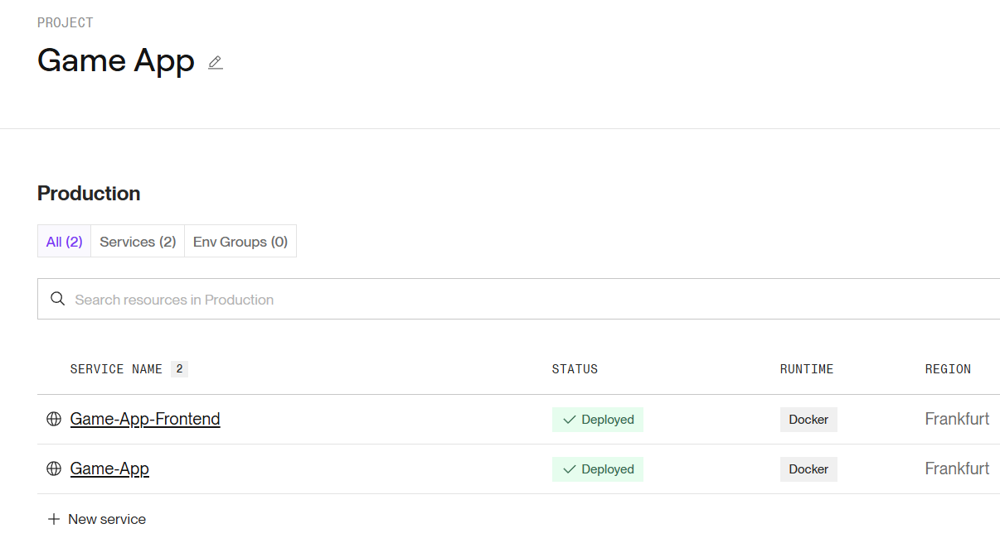

# 🎮 Game API

## 🏁 Goal

Build an app where users choose games, start/stop a timer, and view clear statistics of played time.

## ⚙️ Requirements

Before you begin, ensure you have:

- **Node.js** (v18+ recommended)
- **npm** or **yarn**
- **PostgreSQL** installed and running
- A valid **DATABASE_URL** connection string in `.env`
- Typescript
- Prisma & Firebase
- ERD
- ZOD
- Zustand
- Jest
- Eslint
- Devops:
- GitHub Actions
- Docker
- Render

---

## 🚀 Deployment Overview

This app is deployed on [Render](https://render.com) using Docker containers for both the **frontend** and **backend**. Each service is defined with its own `Dockerfile` and runs independently in production.


### 🌐 Live App

You can access the deployed frontend here:  
🔗 [https://game-app-frontend.onrender.com](https://game-app-frontend.onrender.com)

---

## 🧱 Frontend Deployment

- Built with **Vite** and served via **Nginx**
- Dockerfile uses a multi-stage build:
  - **Build stage**: Installs dependencies, injects Vite environment variables, and runs `npm run build`
  - **Serve stage**: Copies the built app into an Nginx container and exposes port `80`

---

## 🔧 Backend Deployment

- Node.js server with Prisma ORM
- Dockerfile installs dependencies and runs:
  ```sh
  npx prisma generate && node dist/index.js
  ```
- Exposes port `10000` for API access

---

This setup ensures clean separation between frontend and backend services, with scalable deployment via Docker and Render.

# 📦 Database Schema Overview

This project uses **Prisma ORM** with a **PostgreSQL** database.  
The schema defines three core models — **User**, **Game**, and **Score** — forming a simple relational structure for tracking gameplay sessions and player performance. Validated using ZOD. Login authentication using firebase.

---

## 🧑‍💻 User

Represents an authenticated player in the system.

**Fields:**

- `id` — Primary key (auto‑incrementing)
- `email` — Unique email address
- `firebaseId` — Unique Firebase UID for authentication
- `firstName`, `lastName` — Basic profile information
- `avatarUrl` — Optional profile image
- `scores` — One‑to‑many relation to `Score`
- `createdAt` — Timestamp of user creation

**Relationship:**  
A **User** can have **many Scores**.

---

## 🎮 Game

Represents a game available in the platform.

**Fields:**

- `id` — Primary key (auto‑incrementing)
- `title` — Name of the game
- `description` — Optional game description
- `scores` — One‑to‑many relation to `Score`
- `createdAt` — Timestamp of game creation

**Relationship:**  
A **Game** can have **many Scores**.

---

## 🏆 Score

Represents a single gameplay session and its metadata.

**Fields:**

- `id` — Primary key (auto‑incrementing)
- `userId` — Foreign key → `User.id`
- `gameId` — Foreign key → `Game.id`
- `startedAt` — When the session began
- `stoppedAt` — When the session ended (optional)
- `durationMinutes` — Calculated duration (optional)
- `createdAt` — Timestamp of score creation

**Indexes:**

- `@@index([userId])` — Optimizes queries by user
- `@@index([gameId])` — Optimizes queries by game

**Relationship:**  
A **Score** belongs to exactly **one User** and **one Game**.

---

## 🔗 Relationship Summary


- Users can play many games.
- Games can be played by many users.
- Each play session is stored as a Score entry linking a User and a Game.

---

## ⚙️ GitHub Actions CI Overview

This project uses GitHub Actions to automate continuous integration workflows for both the **backend** and **frontend**, triggered on pull requests and pushes to the `main` branch.

### 🔧 Backend Workflow

Runs on every PR and push to `main`, ensuring code quality and dependency integrity.

**Steps:**

- Checkout repository
- Set up Node.js with version matrix and cache
- Install dependencies using `npm ci`
- Run ESLint for code linting

### 🎨 Frontend Workflow

Validates build integrity and code style on every PR and push to `main`.

**Steps:**

- Checkout repository
- Set up Node.js with version matrix and cache
- Install dependencies using `npm ci`
- Run production build (`npm run build`)
- Run ESLint for code linting

---

These workflows help catch errors early, enforce consistent code style, and ensure both backend and frontend remain production-ready throughout development.

# ✅ Unit Testing: `getAllUsers` Controller

This section documents how the `getAllUsers` controller is tested using Jest, TypeScript, and mocked dependencies. The goal is to ensure the controller behaves correctly **without connecting to a real database or external services**.

---

## 🎯 Purpose of the Test

The test suite verifies that the `getAllUsers` controller:

1. Returns a list of users when data exists
2. Returns a `404` response when no users are found
3. Returns a `500` response when Prisma throws an error

All tests run in isolation using mocked Prisma and Express response objects.

---

## 🧩 How the Test Works

### 1. Mocking Prisma

The controller imports Prisma from `src/prisma.ts`.  
To avoid hitting a real database, the test replaces that module with a Jest mock:

```ts
jest.mock("../../prisma", () => ({
  prisma: {
    user: {
      findMany: jest.fn(),
    },
  },
}));
```

This ensures:

- No real PrismaClient instance is created
- No database connection is attempted
- The test can fully control what `findMany()` returns

---

### 2. Mocking Express Response (`res`)

Express response objects are chainable (`res.status().json()`), so the test creates a minimal mock:

```ts
const createMockResponse = () => {
  const res: Partial<Response> = {};
  res.status = jest.fn().mockReturnValue(res);
  res.json = jest.fn().mockReturnValue(res);
  return res as Response & { status: jest.Mock; json: jest.Mock };
};
```

This allows the test to assert:

- Which status code was sent
- What JSON payload was returned

---

## ✅ Test Scenarios

### **1. Users exist**

- Prisma mock returns an array of users
- Controller should respond with `200`
- JSON body should match the returned users

This validates the “happy path”.

---

### **2. No users found**

- Prisma mock returns an empty array
- Controller should respond with `404`
- JSON body should include:
  ```json
  { "error": "No students found", "users": [] }
  ```

This ensures empty results are handled correctly.

---

### **3. Prisma throws an error**

- Prisma mock rejects with an error
- Controller should respond with `500`
- JSON body should include:
  ```json
  { "error": "Failed to fetch students" }
  ```

This verifies the controller’s error-handling branch.

The test also suppresses `console.error` output to keep logs clean.

## 🗂️ State Management with Zustand

This project uses **Zustand** as a lightweight, scalable state‑management solution for handling authentication data across the app. Zustand provides a minimal API with no boilerplate, making it ideal for managing global state without the complexity of larger tools like Redux.

### **How It Works**

I define a dedicated `useAuthStore` that centralizes all authentication‑related state:

- **`user`** – the currently authenticated Firebase user
- **`token`** – the user’s auth token, persisted in localStorage
- **`loading`** – a simple flag used during initial auth checks
- **`setUser` / `setToken`** – small, focused setters for updating state
- **`logout`** – a fully encapsulated sign‑out flow that clears Firebase auth and localStorage

Because Zustand stores are just hooks, components can subscribe to exactly the pieces of state they need, avoiding unnecessary re-renders and keeping the codebase clean and predictable.

### **Why Zustand?**

- Minimal setup and zero boilerplate
- Built‑in support for async actions (like Firebase sign‑out)
- Easy to scale as the app grows
- Encourages small, composable state slices rather than monolithic stores

This pattern keeps authentication logic isolated, testable, and easy to reason about—perfect for a modern React/Firebase stack.
